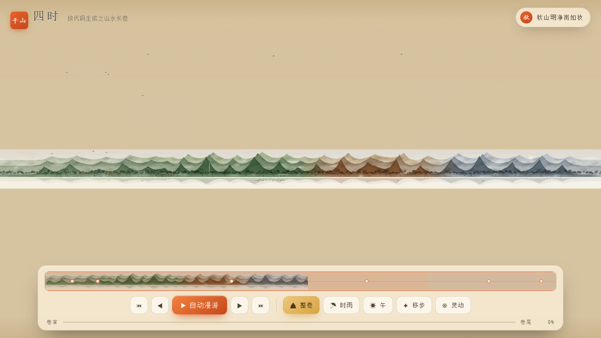
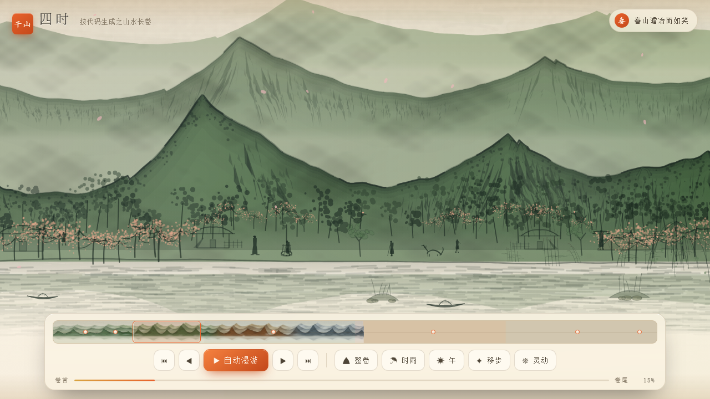
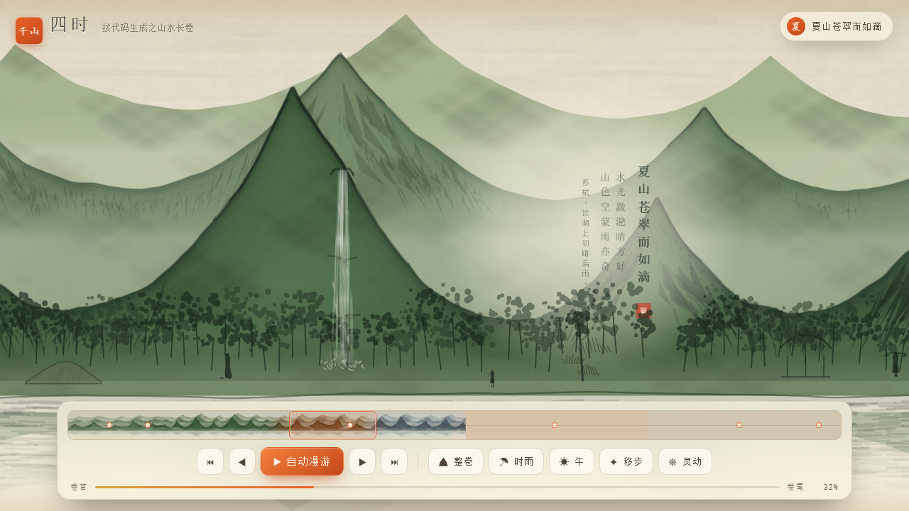
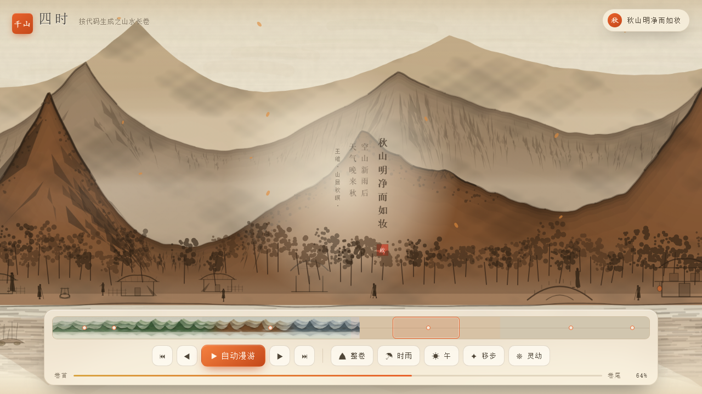
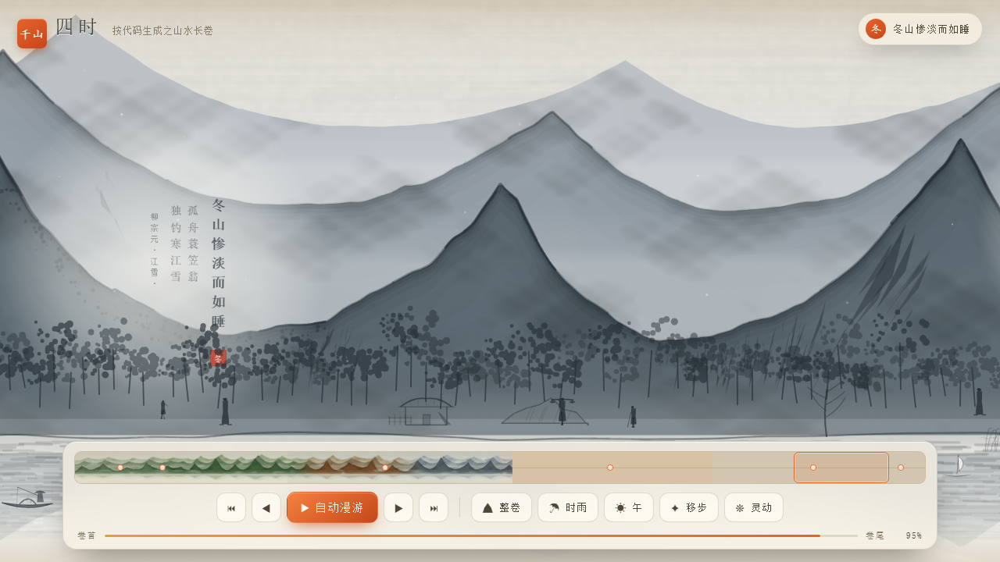
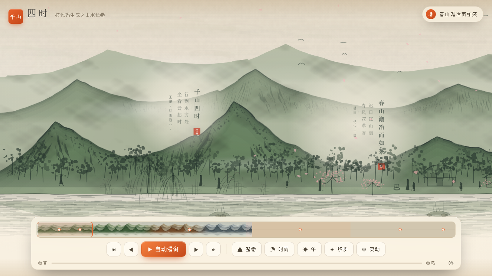
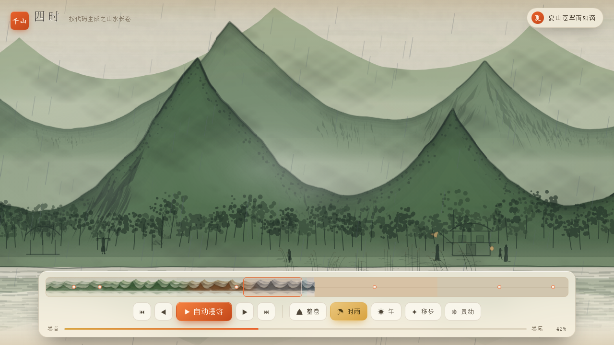

# 千山四时 · 数字长卷

**一幅完全由代码画出来的中国山水长卷**——12000 × 900 世界单位，横向并置春、夏、秋、冬。
零图片素材、零第三方库、零后端：所有山石、树木、舟桥、人物、雨雪云雾，
都是 `Canvas 2D` 里逐笔算出来的。

题跋取自郭熙《林泉高致·山水训》的四时之山：
**春山澹冶而如笑，夏山苍翠而如滴，秋山明净而如妆，冬山惨淡而如睡。**



| 春 · 桃花源 | 夏 · 飞瀑荷塘 |
| --- | --- |
|  |  |
| **秋 · 明净如妆** | **冬 · 惨淡如睡** |
|  |  |

| 卷首村口 | 时雨 |
| --- | --- |
|  |  |

---

## 先看为快

**双击 `index.html` 就能看**——纯静态、无构建、无依赖，也不需要起服务器。
`file://` 直接打开即可（代码里没有任何 `fetch` / `import` / 外部资源）。

想用 `http://` 打开（部分浏览器对 `file://` 的字体渲染更保守）：

```bash
python -m http.server 8788 --bind 127.0.0.1
# 然后访问 http://127.0.0.1:8788/
```

## 怎么看

| 操作 | 效果 |
| --- | --- |
| 拖拽 / 触摸滑动 | 横向漫游（松手带惯性） |
| 滚轮 / 触控板横滑 | 平移 |
| `Ctrl` + 滚轮 / 双指捏合 | 以光标为锚点缩放（0.094× 整卷 ↔ 2.8× 近景） |
| 双击 | 对焦放大；已放大时退回观察视距 |
| 空格 | 自动漫游（到卷尾自动停） |
| `←` `→` | 前后翻一屏 |
| `Home` / `End` | 卷首 / 卷尾 |
| `V` | 整卷概览 ↔ 观察视距 |
| `R` | 时雨 开/关 |
| `M` | 天光 午 → 暮 → 晨 |
| `X` | 随机跳一处 |
| `A` | 灵动层（植被摆动 / 水流 / 人物）开/关 |
| `H` / `?` | 快捷键提示 |
| `Esc` | 关闭题跋卡片 |
| 点水面 | 起一圈涟漪 |
| 点题跋 | 弹出竖排诗句卡片 |

底部一排芯片对应上面这些开关；右上角迷你地图可直接点击跳转。

---

## 四时与题跋

卷上钤着六处可点击的题跋，各自配一句诗（皆为公有领域古诗文）：

| 位置 | 题 | 诗句 | 出处 |
| --- | --- | --- | --- |
| 卷首 | 千山四时 | 行到水穷处，坐看云起时 | 王维《终南别业》 |
| 春 | 春山澹冶而如笑 | 迟日江山丽，春风花草香 | 杜甫《绝句二首》 |
| 夏 | 夏山苍翠而如滴 | 水光潋滟晴方好，山色空蒙雨亦奇 | 苏轼《饮湖上初晴后雨》 |
| 秋 | 秋山明净而如妆 | 空山新雨后，天气晚来秋 | 王维《山居秋暝》 |
| 冬 | 冬山惨淡而如睡 | 孤舟蓑笠翁，独钓寒江雪 | 柳宗元《江雪》 |
| 卷尾 | 逸笔草草 | 不求形似，聊写胸中逸气耳 | 倪瓒《答张藻仲书》 |

另有 15 枚散落的收藏朱印——真迹长卷上总是钤满历代藏印，少了这层「流传有序」的味道，画面就单薄。

## 画面里有什么

构图数据全部写在 `js/scene-data.js` 里，**位置是数据，不是代码**：

| 项 | 数量 |
| --- | --- |
| 峰峦 | 22 座（分春/夏/秋/冬四组，各自的尖峭度与高度不同） |
| 点景 | 54 处（舟 5 · 屋舍 6 · 客栈 3 · 井 3 · 松 4 · 枫 3 · 桥 · 瀑 · 亭 2 · 荷 2 · 犬 · 鸡 2 · 天鹅 …） |
| 芦苇 / 荷塘 / 桃花林 | 5 区 / 1 区 / 4 区（成片铺，不是逐棵摆） |
| 收藏印 · 题跋 | 15 · 6 |
| 行人 | 26 位（挑夫 6 · 书生 6 · 妇人 5 · 儿童 5 · 老叟 4），**速度一律相同** |
| 常住村民 | 15 位（不走动，就站在自家门口：井台边、客栈前、篱下） |

行人为什么速度必须齐一：速度一旦不一致，快的人会追上并穿过慢的人，
半天之后原本次序井然的间距全部乱掉——实测「整屏一个行人都没有」的空窗占比会到 11%。
同速之后间距**刚性保持**，于是「任一时刻视口内至少两人」是可推理的保证，而不是碰运气。

---

## 技术要点

```
index.html
css/style.css
js/util.js         确定性随机（hash / 值噪声 / fbm）、缓动、makeCanvas、LRU
js/scene-data.js   构图数据（世界尺寸、调色板、峰峦、点景、行人、天气配置）
js/painter.js      唯一绘制入口 Painter.paint(ctx, wx, wy, ww, wh, opts)
js/motifs.js       可复用小物件的画法（树 / 桥 / 舟 / 鸟 / 人物…）
js/scroll.js       引擎：视口 + 分块惰性渲染 + LRU + 渐进清晰化 + 惯性
js/fx.js           动态层：粒子（雨雪落花飞鸟涟漪）、云雾、天光
js/alive.js        灵动层：植被摆动 / 水面流动 / 人物行走 / 舟的巡航
js/ui.js           迷你地图、题跋卡片、芯片按钮、进度
```

### 1. 两张画布：静态分片 + 每帧动态

- **静态层**：整幅 12000×900 一次画完会卡死，于是沿横向切成 1000 宽的块，
  只渲染视口附近的块（LRU 上限 6 块），其余靠一份**低清预渲染带**铺满。
  缩放途中因为「要几块」超限时整幅退回低清，避免一半高清一半低清的接缝。
- **动态层**：另一张画布叠在上面每帧重绘，画雨雪、云雾、天光、河水、行人、舟。

### 2. 铁律：分成两片画，必须逐像素相同

分片随时被 LRU 丢掉再重建，所以绘制**不能依赖调用顺序或全局计数器**：
所有随机数从 `h1(n, seed)` / `h2(x, y, seed)` 取，`n` 由世界坐标量化到全局网格算出。
同理，渐变的基准、调色板的取色点都锚在全局网格上，而不是「本片的第几格」——
否则相邻两片在重叠区会取到不同的颜色，拼出一条竖向色差。

### 3. 四季是**连续渐变**，不是四段拼接

调色板沿 x 线性插值（`paletteAt(x)`，按 64 世界单位的全局网格取色），
所以从春拖到夏是「渐渐绿起来」，而不是「走过 3000 就换一张皮」。
同理，雨量、雾气、飘落物也都用**锚点插值**（`rainMulAt(x)`），不按季整段取值。

### 4. 世界锚定 vs 屏幕锚定（本项目最容易埋雷的地方）

| 类别 | 例子 | 尺寸 |
| --- | --- | --- |
| **世界锚定** | 雨、雪、落花、飞鸟、涟漪 | 必须 `世界尺寸 × 视距 s` |
| **屏幕锚定** | 云雾（带视差）、天光 | 按屏幕面积，但要随视距收敛 |

漏乘 `s` 在默认视距（`s≈0.8`）下只差 20%，肉眼看不出来；缩到整卷（`s=0.094`）
就会变成「一条雨丝横跨 8.6 倍画卷高度，整幅糊成灰」。
反过来，尺寸乘了 `s` 却不托下限，概览时 1.1 世界单位的雪粒只剩 0.09px，
**整层雪凭空消失**——那一季就「没有天气」了。

还有一条更隐蔽的：**「现在是什么季节」不是全局量**。卷轴是四季并置的，
所以每颗粒子要问**自己脚下**那一处的季节；按视口中心取一季的话，
缩到整卷时中心必然落在秋天，于是「冬天那一带开始飘秋天的落叶、一粒雪也不下」。

### 5. 叠放次序：灵动层**整层**压在静态层之上

静态层在下、灵动层在另一张画布上且永远在上。
所以**任何要动的东西都会盖住所有静态点景，与两者的远近（y）无关**——
一条横铺的桃花带能把整座村子埋掉。解法只有两个：错开屏幕带，或把批量区在该处**断口**。

---

## 自检工具链

`tools/` 下有一套**量化验证**脚本，不靠肉眼看截图：

```bash
NODE="${NODE:-node}"    # Node 18+ 即可
PY="${PY:-python}"      # 跑像素分析才需要，且要 pip install pillow
CHROME=...              # 无头 Chrome 的位置，非 Windows 默认路径时指定

python -m http.server 8788 --bind 127.0.0.1     # 先起静态服务

"$NODE" tools/weather-check.js     # 跨三档视距量天气层，出 PASS/FAIL
bash tools/smoke.sh                # 交互路径全跑一遍（拖拽/滚轮/键盘/迷你地图/漫游）
bash tools/make-shots.sh           # 重出 shots/ 下十张展示图
bash tools/look.sh <x> <y> <scale> out.png      # 定点观察：对准世界坐标冻表截一帧
```

其余脚本（`isolate.js` / `anim-proof.py` / `flow-x.py` / `freeze-check.js` …）
用于回答「这东西到底动没动、往哪动、动多快」。详见 **[tools/README.md](tools/README.md)**。

工具链路上一律走环境变量（`NODE` / `PY` / `CHROME` / `URL`），
默认用 `PATH` 上的命令，**换台机器不用改脚本**。

---

## 已知取舍

- 这是**程序化绘画**，不是写实渲染：山石树石都是笔触与噪声的合成，
  放大到 2.8× 会看见笔法变粗，这是有意为之（保水墨气质优先于保清晰度）。
- **概览视距下给粒子托了 0.5~0.55px 的下限**，代价是它们相对画卷偏大、
  收益是「缩到整卷时那一季还在」。这是刻意打破「与视距无关」的一处取舍，
  代码注释里写明了，别当成 bug「修」掉。
- 各季天气是「氛围」而非气象模拟：雨是按钮触发的，雪按冬季带自动下。
- 画面按 16:9 横屏设计；窄屏（手机竖屏）能看，但观察视距下会只剩画卷中段。

## 许可

本项目以 **MIT License** 发布，全文见 [LICENSE](LICENSE)。

```
Copyright (c) 2026 ink-scroll contributors

Permission is hereby granted, free of charge, to any person obtaining a copy
of this software and associated documentation files (the "Software"), to deal
in the Software without restriction, including without limitation the rights
to use, copy, modify, merge, publish, distribute, sublicense, and/or sell
copies of the Software, and to permit persons to whom the Software is
furnished to do so, subject to the following conditions:

The above copyright notice and this permission notice shall be included in all
copies or substantial portions of the Software.

THE SOFTWARE IS PROVIDED "AS IS", WITHOUT WARRANTY OF ANY KIND, EXPRESS OR
IMPLIED, INCLUDING BUT NOT LIMITED TO THE WARRANTIES OF MERCHANTABILITY,
FITNESS FOR A PARTICULAR PURPOSE AND NONINFRINGEMENT. IN NO EVENT SHALL THE
AUTHORS OR COPYRIGHT HOLDERS BE LIABLE FOR ANY CLAIM, DAMAGES OR OTHER
LIABILITY, WHETHER IN AN ACTION OF CONTRACT, TORT OR OTHERWISE, ARISING FROM,
OUT OF OR IN CONNECTION WITH THE SOFTWARE OR THE USE OR OTHER DEALINGS IN THE
SOFTWARE.
```
